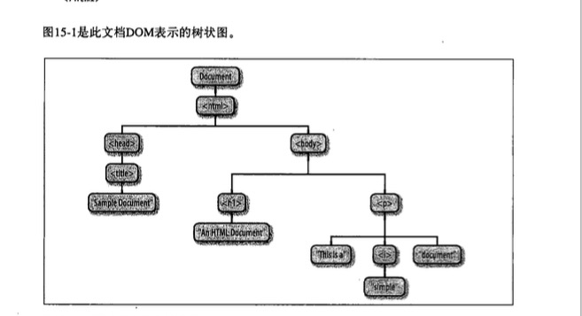

#DOM模型概述
***
##目录
###[1. 基本概念](#基本概念)

##<a id="基本概念">1. 基本概念</a>
#### 1. 什么是DOM?

>DOM是JS操作网页的接口,全称为"文档对象模型".浏览器会根据DOM模型将网页解析成一个树状结构(DOM). 对于操作网页而言,DOM模型是最好的方法.其历史根源可自行百度.(哈哈哈哈~)

#### 2. 什么是节点?

>DOM 的最小组成单位叫做节点（node）。文档的树形结构（DOM 树），就是由各种不同类型的节点组成。每个节点可以看作是文档树的一片叶子。

节点的类型有七种。
>
*  Document：整个文档树的顶层节点 (我也不懂是什么)
*  DocumentType：doctype标签（比如<!DOCTYPE html>）
*  Element：网页的各种HTML标签（比如\<body>、\<a>等）(!!!必须掌握)
*  Attribute：网页元素的属性（比如class="right"）(!!!必须掌握)
*  Text：标签之间或标签包含的文本  (会经常用到)
*  Comment：注释
*  DocumentFragment：文档的片段

#### 3. 节点树

