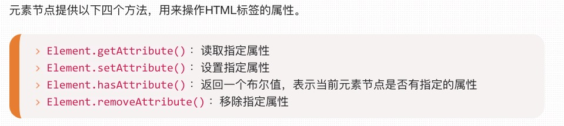
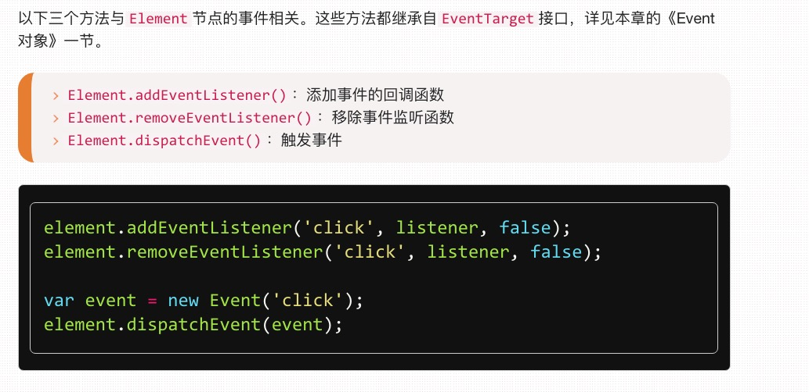

# Element对象
***

>Element对象对应网页的HTML标签元素。每一个HTML标签元素，在DOM树上都会转化成一个Element节点对象（以下简称元素节点）。

## 目录
###[1. 特征相关的属性](#特征相关的属性)
###[2. 盒模型相关的属性](#盒模型相关的属性)
###[3. 节点相关的属性](#节点相关的属性)
###[4. 属性相关的方法](#属性相关的方法)
###[5. 查找相关的方法](#查找的相关方法)
###[6. 事件相关的方法](#事件相关的方法)
###[7. 其他方法](#其他方法)

***
## <a id="特征相关的属性">1. 特征相关的属性</a>
>以下属性与元素特点本身的特征相关
>
>返回元素的相应特征

1. Element.attributes
2. Element.id ( ** )
3. Element.tagName ( ** )
4. Element.innerHTML ( *** )
5. Element.outerHTML
6. Element.className ( *** )
7. Element.classList ( *** )

## <a id="盒模型相关的属性">2. 盒模型相关的属性</a>
>以下内容非非非常重要!!!
>
1. Element.clientHeight ( *** )  返回元素节点可见部分的高度
2. Element.clientWidth ( *** )  返回元素节点可见部分的宽度
3. Element.clientLeft ( *** ) 元素节点左边框（left border）的宽度
4. Element.clientTop ( *** ) 网页元素顶部边框的宽度，单位为像素。

&nbsp
 
>
1. Element.scrollHeight ( *** )
2. Element.scrollWidth ( *** )
3. Element.scrollLeft ( *** )
4. Element.scrollTop ( *** ) 

&nbsp
>
1. Element.offsetHeight ( *** )
2. Element.offsetWidth ( *** )
3. Element.offsetLeft ( *** )
4. Element.offsetTop ( *** )

* Element.style  ( *** )

## <a id="节点相关的属性">3. 节点相关的属性</a>
>以下属性返回元素节点的相关节点

1. Element.children ( *** )
2. Element.childElementCount 
3. Element.firstElementChild ( *** )
4. Element.lastElementChild ( *** )
5. Element.nextElementSibling ( *** )
6. Element.previousElementSibling ( *** )
7. Element.offsetParent 

## <a id="属性相关的属性">4. 属性相关的属性</a>
劳驾移步 << 6.4属性的操作 >>

## <a id="查找相关的属性">5. 查找相关的属性</a>
1. Element.querySelector() ( ** )
2. Element.querySelectorAll() ( ** )
3. Element.getElementsByClassName() ( *** )
4. Element.getElementsByTagName() ( *** )
5. Element.closest() ( * )
6. Element.matches() ( * )

## <a id="事件相关的方法">6. 事件相关的方法</a>

## <a id="事件相关的方法">6. 事件相关的方法</a>
1. Element.scrollIntoView()
2. Element.getBoundingClientRect()
3. Element.getClientRects()
4. Element.insertAdjacentHTML()
5. Element.remove()
6. Element.focus()
